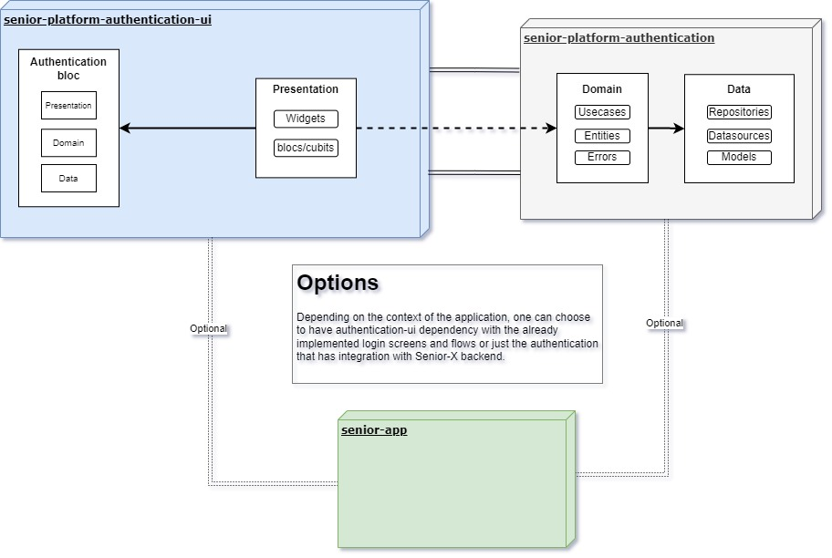

# Senior Platform Authentication Ui
O objetivo deste projeto é prover uma experiência única de autenticação com aplicativos integrados a Senior X. Este pacote utilizar o  senior_platform_authentication em dart que fornece uma integração já implementada ao backend de autenticação do Senior X. 

Sendo assim, para manter a integridade da experiência de autenticação, é importante que aplicativos que necessitem de autenticação com a plataforma Senior-X tenham dependência deste pacote. Caso seja necessário alguma adaptação ou customização maior no fluxo de autenticação, pode-se utilizar o pacote senior_platform_authentication e implementar as regras de forma manual ou contribuir com este pacote para adicionar os casos de usos necessários.

## Arquitetura
A arquitetura foi baseada no Clean Architecture, entretanto com algumas adaptações para o escopo do projeto após análise técnica da equipe responsável pelo desenvolvimento incicial deste projeto.



## Como utilizar

Adicione o pacote no pubspec.yaml e execute `flutter pub get`:
```yaml
dependencies:
  senior_platform_authentication_ui: ^1.0.1
```
_Verifique qual a última versão disponível no [pub.dev](https://pub.dev/packages/senior_platform_authentication_ui)_

Importe o pacote senior_platform_authentication_ui.
```dart
import 'package:senior_platform_authentication_ui/senior_platform_authentication_ui.dart';
```

É obrigatório que a classe principal seja inicializada na main thread de sua aplicação.
```dart
SeniorAuthentication.initialize(
  encryptionKey: 'sua chave de criptografia de 32 caracteres alfanuméricos',
);
```

Também podemos inicializar escolhendo o ambiente para o qual as requisições irão ser direcionadas:
```dart
SeniorAuthentication.initialize(
  encryptionKey: 'sua chave de criptografia de 32 caracteres alfanuméricos',
  platformEnvironment: PlatformEnvironment.homolog,
);
```

Além disso, existem outras configurações disponíveis no método `initialize`, veja:
| Parâmetro             | Valor default                  | Descrição                                          |
| :-------------------: | :----------------------------: | :------------------------------------------------- |
| platformEnvironment   | PlatformEnvironment.production | Ambiente em que as requisições serão direcionadas. 
| enableLoginOffline    | false                          | Habilita ou desabilita o login offline. Tem efeito somente quando utilizado em conjunto com o package [senior-platform-authentication-ui](https://pub.dev/packages/senior_platform_authentication_ui). |
| automaticLogon        | true                           | Define se o login deve ser feito de forma automática. Tem efeito somente quando utilizado em conjunto com o package [senior-platform-authentication-ui](https://pub.dev/packages/senior_platform_authentication_ui) e quando `enableLoginOffline` estiver habilitado. |
| includePhoto          | false                          | Habilita ou desabilita a inclusão da photo do usuário nas chamadas de getUser. |
| baseUrl               | ''                             | Deve ser usado apenas quando `platformEnvironment` possuir o valor PlatformEnvironment.custom. Define a baseUrl de forma customizada. |
| frontendUrl           | ''                             | Deve ser usado apenas quando `platformEnvironment` possuir o valor PlatformEnvironment.custom. Define a frontendUrl de forma customizada. |
|enableBiometry           | false                        | Deve ser utilizado para ativar a opção de login com biometria. |
|enableBiometryOnly       | false                        | Deve ser utilizado quando o produto que está implementando o pacote deseja que o usuário utilize exclusivamente a biometria, excluindo outras formas de segurança, como senha ou PIN. Para que a opção 'enableBiometryOnly' receba o valor 'true', é obrigatório que 'enableBiometry' esteja definido como 'true'. |
|enableLoginWithKey       | false                        | Deve ser utilizado quando se deseja autenticar uma chave de apliação no dispositivo. Tem efeito somente quando utilizado em conjunto com o package [senior-platform-authentication-ui](https://pub.dev/packages/senior_platform_authentication_ui). Utilizar a KeyAuthenticationScreen responsavel pela captura das informções |
| encryptionKey         |           N/A                  | Chave de criptografia contendo 32 caracteres alfanuméricos que será utilizada no momento de armazenar e ler dados sensíveis | 


**Atenção:** O parâmetro `encryptionKey` deverá ser sempre o mesmo, caso contrário não será possível a descriptografia dos dados.

Coloque um BlocProvider na raiz da aplicação Flutter. Deste modo, poderá ter acesso ao estado da autenticação a qualquer momento do ciclo de vida de seu aplicativo.

**Obs:** É extremamente recomendável colocar o componente base do [Senior Design System](https://pub.dev/packages/senior_design_system) no primeiro nível e logo abaixo dele o BlocProvider. O pacote senior_platform_authentication_ui foi construído com dependência do Design System da Senior.

```dart
class ExampleApp extends StatelessWidget {
  const ExampleApp({super.key});

  @override
  Widget build(BuildContext context) {
    return SeniorDesignSystem(
      child: BlocProvider(
        create: (context) =>
            AuthenticationBloc()..add(CheckAuthenticationRequested()),
        child: const AppView(),
      ),
    );
  }
}
```

É importante ressaltar que o AuthenticationBloc funciona como um singleton.

Recomendamos utilizar a seguinte abordagem para controle de rotas conforme o status da autenticação:

```dart
class AppView extends StatefulWidget {
  const AppView({super.key});

  @override
  State<AppView> createState() => _AppViewState();
}

class _AppViewState extends State<AppView> {
  final _navigatorKey = GlobalKey<NavigatorState>();

  NavigatorState get _navigator => _navigatorKey.currentState!;

  @override
  Widget build(BuildContext context) {
    return MaterialApp(
      navigatorKey: _navigatorKey,
      builder: (context, child) {
        return BlocListener<AuthenticationBloc, AuthenticationState>(
          listener: (context, state) {
            switch (state.status) {
              case AuthenticationStatus.authenticated:
                _navigator.pushAndRemoveUntil<void>(
                  MaterialPageRoute<void>(builder: (_) => const HomeScreen()),
                  (route) => false,
                );
                break;
              case AuthenticationStatus.unauthenticated:
                _navigator.pushAndRemoveUntil<void>(
                  MaterialPageRoute<void>(
                    builder: (_) => const LoginScreen(),
                  ),
                  (route) => false,
                );
                break;
              case AuthenticationStatus.unknown:
                break;
            }
          },
          child: child,
        );
      },
      onGenerateRoute: (_) => SplashScreen.route(),
    );
  }
}
```

## Biometria

O pacote senior_platform_authentication_ui oferece uma integração com o package [local_auth](https://pub.dev/packages/local_auth) para utilização da biometria.

Para ativar a biometria no seu projeto, siga os seguintes passos:

### Configuração no Android

No arquivo `android/app/src/main/AndroidManifest.xml`, adicione a seguinte linha de código dentro da tag `<application>`:

```xml
<uses-permission android:name="android.permission.USE_BIOMETRIC" />
  ```

### Configuração no iOS
- ios/Runner/Info.plist
  - deve-se adicionar a seguinte linha de código dentro da tag <dict>:
  - a linha de codigo e habilita o uso do FaceId.
  ```xml
    <key>NSFaceIDUsageDescription</key>
    <string>authenticating using face id</string>
  ```

### Configuração da MainActivity
 Deve-se alterar o arquivo MainActivity.java ou MainActivity.kt
   No exemplo do projeto foi alterado o arquivo MainActivity.kt
   No exemple foi nescessario adicionar esse linha de código porque o package precisava validar as bimetrias cadastradas.
  ```kotlin
   package com.example.senior_authentication_ui_example

    import io.flutter.embedding.android.FlutterFragmentActivity

   class MainActivity: FlutterFragmentActivity() {

  }
  ```
 Se o produto que está sendo implementado enfrentar problemas ao acessar a biometria, é aconselhável verificar o pacote [local_auth](https://pub.dev/packages/local_auth) para confirmar se há alguma atualização ou configuração necessária para o acesso à biometria.
  

Para a utilização da biometria deve-se alterar o arquivo main.dart do projeto que estiver implementando o package, deve-se adicionar a seguinte linha de código:
```dart
SeniorAuthentication.initialize(
  enableBiometry: true, //Deve ser utilizado para ativar a opção de login com biometria.
  enableBiometryOnly: true, //Deve ser utilizado quando o produto que está implementando o pacote deseja que o usuário utilize exclusivamente a biometria, excluindo outras formas de segurança, como senha ou PIN. Para que a opção 'enableBiometryOnly' receba o valor 'true', é obrigatório que 'enableBiometry' esteja definido como 'true'.
);
```
## Como contribuir
Para contribuir, basta abrir um Merge Request para algum dos mantedores do projeto seguindos as boas práticas acordadas nas seções abaixo.

### Cobertura de testes
Entendemos que para manter a qualidade e integridade do código, é exigido uma cobertura de testes de pelo menos 80% para o que foi desenvolvido. Nossa sugestão é utilizar as extensões Coverage Gutters e Flutter Coverage para desenvolvimento dos testes.

### Formatação de código
Já está incluído um arquivo de configuração com as configurações de identação do projeto, por padrão utilizamos o reocmendável do SDK (80). Por favor, não modificar e seguir este padrão.

### Armazenar dados locais
Utilizamos o package flutter_secure_storage para armazenamento de dados locais. Existem hoje dois local datasources para armazenagem, o SecureStorageDatasource e o PreferencesStorageDatasource. O primeiro possui como objetivo armazenar apenas dados referentes a autenticação, como token, expiração e usuário por exemplo. O segundo serve para armazenar preferencias do usuário, como por exemplo se a mensagem do onboarding do SAML está habilitada.

Caso seja necessário armazenar mais dados no futuro, cabe ao desenvolvedor avaliar o contexto se é algo de preferências do usuário, utilizar o PreferencesStorageDatasource. Caso seja relacionado a algum dado sensível da autenticação, utilizar o SecureStorageDatasource.
